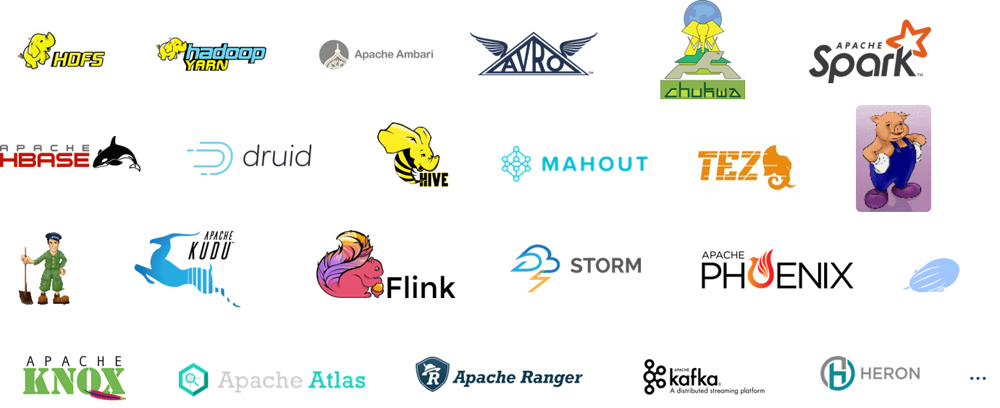

# Introduction to the Big Data ecosystem

In this university tutorial, we will look into the Hadoop ecosystem by browsing through the [Hortonworks Data Platform Sandbox](https://www.cloudera.com/downloads/hortonworks-sandbox.html) virtual machine.

Expect to interact with:

- HDFS
- MapReduce / YARN
- Pig / Hive
- Flume
- Storm
- Zeppelin
