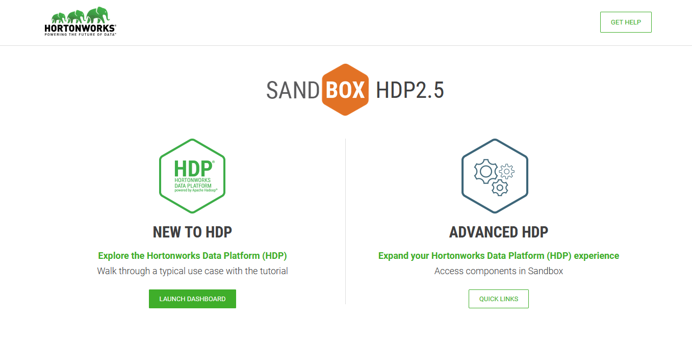

# Prerequisites

## Objectives

- [ ] Download a Hadoop virtual machine to use in VirtualBox
- [ ] Configure the memory used by the virtual machine to not kill our machine
- [ ] Start the virtual machine.

## Setup the environment 

Before working on the tutorial, we need a working Hadoop cluster. We are going to use:

- [VirtualBox](https://www.virtualbox.org/) to run the virtual machine.
- [HDP 2.5.0](https://www.cloudera.com/downloads/hortonworks-sandbox.html). It is less demanding in terms of resources than version 3+ and sufficient for this tutorial.

Follow the given steps to import the machine in VirtualBox:

- Download [Hortonworks Sandbox 2.5.0](https://www.cloudera.com/downloads/hortonworks-sandbox/hdp.html) and unzip the appliance for VirtualBox.
- Import the `.ova` file into VirtualBox. **Don't start it yet** if you want to configure it.
  - You may configure the VM to use more or less RAM depending on your machine, through the `Configuration > System` view. The recommended value is around 6-8 Go RAM, but you will get away with using 2-4 Go.
- Start the virtual machine with the `Start` green arrow. This may take a few minutes.
  - If the virtual machine stops during startup, it is generally because you don't have enough resources. Try to open a process manager and kill some RAM-consuming processes, or lower the RAM needed by the virtual machine using the above step.
- Open a web browser to [http://localhost:8888](http://localhost:8888) to be greeted with the Hortonworks Data Platform dashboard

## Recap

- [x] We have imported the Hortonworks Data Platform into VirtualBox
- [x] We configured the RAM the Virtual Machine will use for the tutorial
- [x] We started the Virtual Machine and checked it runs correctly on our machine
