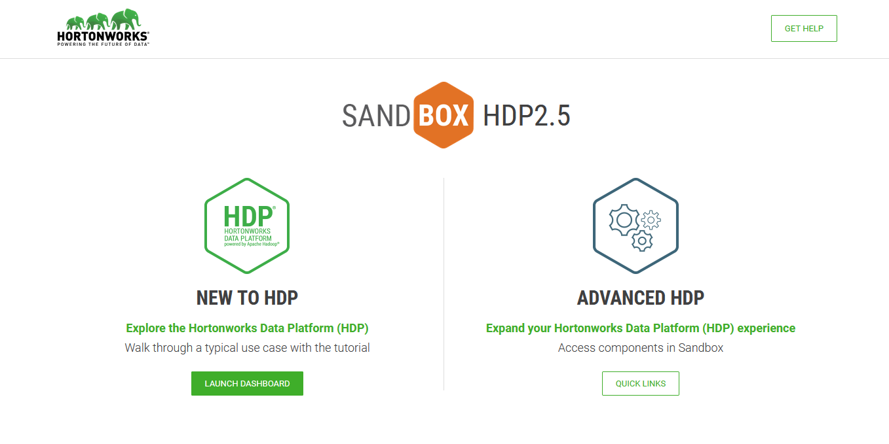
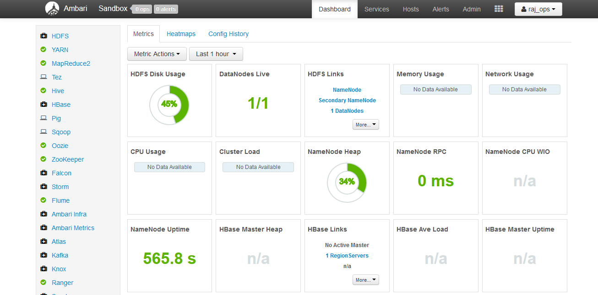
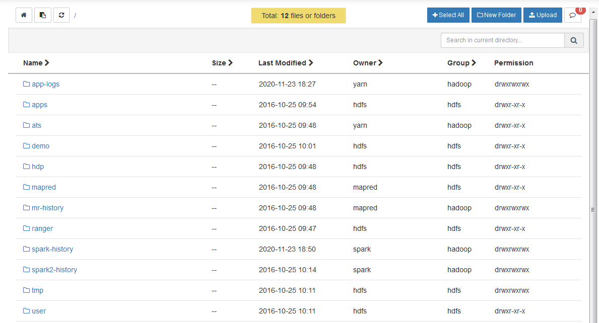
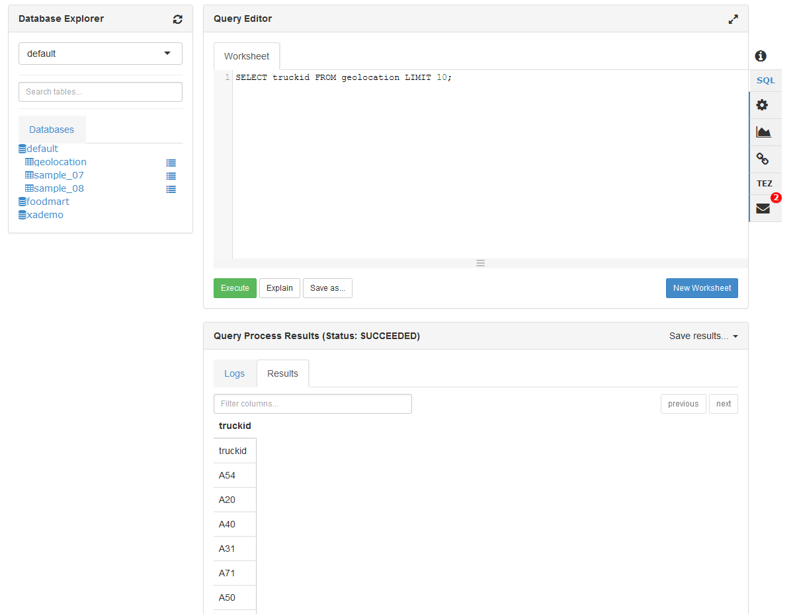

# TD1 - First steps in the Hadoop ecosystem

For this tutorial, we are going to focus on managing our cluster through [Ambari](https://ambari.apache.org/) and playing with some Hadoop features.

## Objectives

- [ ] Get used to the Ambari interface
- [ ] Upload data into HDFS - Hadoop Distributed File System
- [ ] Run MapReduce jobs on data in HDFS
- [ ] Run Pig jobs on data in HDFS
- [ ] Run Hive jobs on data in HDFS

## 1. Browsing the Ambari interface

- Open a web browser to [http://localhost:8888](http://localhost:8888) to be greeted with the Hortonworks Data Platform dashboard. Click on `Launch Dashboard` in the left column to pop-up a new browser to Ambari. _You can also go to [http://localhost:8080](http://localhost:8080) directly._


  
- Enter the credentials: **raj_ops**/**raj_ops**. You will arrive on the Ambari dashboard, your cockpit into the Hadoop platform.



!!! note "Browsing the Ambari dashboard"
    - In the left sidebar, you should recognize some of the Hadoop services presented in the lecture.
    - The main area displays KPIs to monitor the platform. Apart from Supervisors Live, there should not have too many red flags.
    - The topbar has a few links to running services, list of hosts and an admin portal.
    - Some links go to `http://sandbox.hortonworks.com`, replace that by `http://localhost` if you want to check them out.

Browse the dashboard to answer the following:

!!! question "Questions on the Ambari dashboard"
    - How many Namenodes/Datanodes are currently running in the virtual machine ?
    - What is the jdbc URL to connect to the Hive server ?
    - The YARN cluster comprises of a Resource Manager and a Node Manager. How do you restart all Node Managers ?

## 2. Uploading files to HDFS

There are two ways to upload data to HDFS: from the Ambari Files View and from a terminal.

In this section we will:

- [ ] Upload the `data` folder of the project (which you can find [here](https://github.com/andfanilo/hdp-tutorial/tree/main/data)) into HDFS through the Ambari Files View
- [ ] Move folders, then upload the [titanic.csv](https://github.com/andfanilo/hdp-tutorial/blob/main/data/titanic.csv) file in HDFS with the command line.

### Using the Ambari Files View

!!! question "Question"
    Find the Ambari Files View.



- Create a new folder `root` inside `/user`.
- Change the permissions of the folder `/user/root` to add `group` and `other` write/execute permissions. _This will prove necessary so the `root` user can actually access its own folder from the command-line._


- Enter the `/user/root` folder, create a new `data` folder and upload `geolocation.csv` and `trucks.csv` inside. You should have `/user/root/data/geolocation.csv` and `user/root/data/trucks.csv` by the end.

We now have data in HDFS!

- **geolocation.csv** – This is the collected geolocation data from the trucks. It contains records showing truck location, date, time, type of event, speed, etc.
- **trucks.csv** – This is data was exported from a relational database and it shows information on truck models, driverid, truckid, and aggregated mileage info.

But what does it mean? You have to imagine the Hadoop Data Platform is actually a remote cluster of machines, so when you upload a big file in HDFS it gets cut into blocks of 64MB and spread accross multiple DataNodes, and the NameNode keeps a reference for this file in HDFS to all blocks in the cluster.

!!! info 
    - The URL `/user/root/data/geolocation.csv` in Ambari Views is actually `hdfs:///user/root/data/geolocation.csv`. The `hdfs:///` specifies to look into the HDFS cluster instead of locally when using a HDFS client.
    - `hdfs:///` is a shortcut for `hdfs://<host>:<port>/` so you won't need to specify `hdfs://sandbox.hortonworks.com:8020/` every time.

**Recap**: 

- [x] we have uploaded data into HDFS, in the `/user/root` folder.

### Using the Command-line

In this section, we will use the command-line to check that HDFS indeed has our data files in `/user/root`, then we will upload the [titanic.csv](https://github.com/andfanilo/hdp-tutorial/blob/main/data/titanic.csv).

!!! tip
    :student: Don't be discouraged by the command-line. It is one of the best ways to interact with remote systems, enabling scripting and copy-pasting commands!
    
    I recommend taking advantage of this session to follow the `Directly ssh into the machine` section, and download and try PuTTY on Windows, or use the terminal on Mac/Linux, to connect to remote machines like this virtual machine. This experience is especially helpful in enterprise when you need to run commands on remote machines.

`Directly ssh into the machine`
:    - On Windows, use an ssh client like [PuTTy](https://www.chiark.greenend.org.uk/~sgtatham/putty/latest.html), then SSH into localhost on port 2222. Credentials are **root**/**hadoop**.


- You can also, especially on Mac/Linux machines, open a terminal and directly ssh into the virtual machine with `ssh -p 2222 root@localhost`.

`Using the integrated browser-based shell`
:    - You can connect to a shell in the Virtual machine with your browser in http://localhost:4200. Credentials are **root**/**hadoop**.


!!! note
    In both cases you will be asked to change your root password. Type the current password again then change to a long password. Just remember it for future sessions :smile:.

---

**Moving the data folder to geoloc**

Now that you are connected to your virtual machine:

- You can access the `hdfs` command from the terminal. This should output the help from the command line.
- Display the version of HDFS with `hdfs version`.

??? note "Output"
    ```
    ssh -p 2222 root@localhost
    Could not create directory '/home/.../.ssh'.
    The authenticity of host '[localhost]:2222 ([127.0.0.1]:2222)' can't be established.
    Are you sure you want to continue connecting (yes/no)? yes
    Failed to add the host to the list of known hosts (/home/.../.ssh/known_hosts).
    root@localhost's password:
    Last login: Sun Nov 29 13:19:19 2020 from 10.0.2.2
    [root@sandbox ~]# hdfs                                                                       
    Usage: hdfs [--config confdir] [--loglevel loglevel] COMMAND                                 
        where COMMAND is one of:                                                              
    dfs                  run a filesystem command on the file systems supported in Hadoop.     
    classpath            prints the classpath                                                  
    namenode -format     format the DFS filesystem                                             
    secondarynamenode    run the DFS secondary namenode                                        
    namenode             run the DFS namenode                                                  
    journalnode          run the DFS journalnode                                               
    zkfc                 run the ZK Failover Controller daemon                                 
    datanode             run a DFS datanode                                                    
    dfsadmin             run a DFS admin client                                                
    envvars              display computed Hadoop environment variables                         
    haadmin              run a DFS HA admin client                                             
    fsck                 run a DFS filesystem checking utility                                 
    balancer             run a cluster balancing utility                                       
    jmxget               get JMX exported values from NameNode or DataNode.                    
    mover                run a utility to move block replicas across                           
                        storage types                                                         
    oiv                  apply the offline fsimage viewer to an fsimage                        
    oiv_legacy           apply the offline fsimage viewer to an legacy fsimage                 
    oev                  apply the offline edits viewer to an edits file                       
    fetchdt              fetch a delegation token from the NameNode                            
    getconf              get config values from configuration                                  
    groups               get the groups which users belong to                                  
    snapshotDiff         diff two snapshots of a directory or diff the                         
                        current directory contents with a snapshot                            
    lsSnapshottableDir   list all snapshottable dirs owned by the current user                 
                                                    Use -help to see options                     
    portmap              run a portmap service                                                 
    nfs3                 run an NFS version 3 gateway                                          
    cacheadmin           configure the HDFS cache                                              
    crypto               configure HDFS encryption zones                                       
    storagepolicies      list/get/set block storage policies                                   
    version              print the version                                                     
                                                                                                
    Most commands print help when invoked w/o parameters.                                        
    [root@sandbox ~]# hdfs version                                                               
    Hadoop 2.7.3.2.5.0.0-1245                                                                    
    Subversion git@github.com:hortonworks/hadoop.git -r cb6e514b14fb60e9995e5ad9543315cd404b4e59 
    Compiled by jenkins on 2016-08-26T00:55Z                                                     
    Compiled with protoc 2.5.0                                                                   
    From source with checksum eba8ae32a1d8bb736a829d9dc18dddc2                                   
    This command was run using /usr/hdp/2.5.0.0-1245/hadoop/hadoop-common-2.7.3.2.5.0.0-1245.jar 
    ```

!!! tip
    The `hdfs dfs` command gives you access to all commands to interact with files in HDFS. Then `hdfs dfs <command> -h` gives you the command manual.

- List all folders inside HDFS with `hdfs dfs -ls`.
    - The command `hdfs dfs -ls` will take you to `hdfs:///user/root`. `hdfs` uses your UNIX username to go to the HDFS home location. Since you're connected using `root` in the Virtual Machine, it connects by default to `hdfs:///user/root`.

- Rename the `hdfs:///user/root/data` folder to `hdfs:///user/root/geoloc` with `hdfs dfs -mv`.
    - Remember by default that `hdfs dfs -mv data geoloc` is equivalent to `hdfs dfs -mv hdfs:///user/root/data hdfs:///user/root/geoloc`.

**Download the Titanic dataset into HDFS**

- Use the `wget` command to download the [Titanic dataset](https://raw.githubusercontent.com/andfanilo/hdp-tutorial/main/data/titanic.csv) in the filesystem of your virtual machine. 
  - Verify the file is present with `ls` and correct with `head -n 5 titanic.csv`.

??? note "Output"
    ```
    [root@sandbox ~]# wget https://raw.githubusercontent.com/andfanilo/hdp-tutorial/main/data/titanic.csv
    --2020-11-29 14:13:59--  https://raw.githubusercontent.com/andfanilo/hdp-tutorial/main/data/titanic.csv
    Resolving raw.githubusercontent.com... 151.101.120.133
    Connecting to raw.githubusercontent.com|151.101.120.133|:443... connected.
    HTTP request sent, awaiting response... 200 OK
    Length: 60303 (59K) [text/plain]
    Saving to: "titanic.csv"

    100%[==============================================================================================================================>] 60,303      --.-K/s   in 0.008s

    2020-11-29 14:13:59 (6.98 MB/s) - "titanic.csv" saved [60303/60303]

    [root@sandbox ~]# ls
    anaconda-ks.cfg  blueprint.json  build.out  hdp  install.log  install.log.syslog  sandbox.info  start_ambari.sh  start_hbase.sh  titanic.csv
    [root@sandbox ~]# head -5 titanic.csv
    PassengerId,Survived,Pclass,Name,Sex,Age,SibSp,Parch,Ticket,Fare,Cabin,Embarked
    1,0,3,"Braund, Mr. Owen Harris",male,22,1,0,A/5 21171,7.25,,S
    2,1,1,"Cumings, Mrs. John Bradley (Florence Briggs Thayer)",female,38,1,0,PC 17599,71.2833,C85,C
    3,1,3,"Heikkinen, Miss. Laina",female,26,0,0,STON/O2. 3101282,7.925,,S
    4,1,1,"Futrelle, Mrs. Jacques Heath (Lily May Peel)",female,35,1,0,113803,53.1,C123,S
    ```

To copy files from your local machine to HDFS, there is `hdfs dfs -copyFromLocal <local_file> <path_in_HDFS>`.

- Build the `/user/root/test` HDFS folder with `hdfs dfs mkdir <path_to_folder>`.
- Copy `titanic.csv` file from the local VM into the `/user/root/test` HDFS folder.

**Changing permissions for hdfs:///tmp**

- Currently, the `hdfs:///tmp` folder doesn't have permissions for everyone to write in.
  In the Hadoop ecosystem, `root` is not the superuser but `hdfs` is. So we need to be in the `hdfs` user before running set permissions. Run the following script.

```sh
sudo su -
su hdfs
hdfs dfs -chmod -R 777 /tmp
```

_Don't forget to `exit` to go back to the `root` user._

**Recap**

- [x] In `hdfs:///user/root/`, we have moved the contents of the `data` folder into `geoloc`
- [x] We downloaded `titanic.csv` dataset into the virtual machine, then sent it to HDFS in `hdfs:///user/root/test`.
- [x] We changed permissions for `hdfs:///tmp`.

??? note "Output"
    ```
    [root@sandbox ~]# hdfs dfs -ls /user/root/geoloc
    Found 2 items
    -rw-r--r--   3 raj_ops hdfs     526677 2020-11-23 17:56 /user/root/geoloc/geolocation.csv
    -rw-r--r--   3 raj_ops hdfs      61378 2020-11-23 17:56 /user/root/geoloc/trucks.csv
    [root@sandbox ~]# hdfs dfs -ls /user/root/test
    Found 1 items
    -rw-r--r--   1 root hdfs      60301 2020-11-24 14:59 /user/root/test/titanic.csv
    [root@sandbox ~]# hdfs dfs -ls /tmp
    Found 6 items
    drwxrwxrwx   - raj_ops   hdfs          0 2020-11-27 16:10 /tmp/.pigjobs
    drwxrwxrwx   - raj_ops   hdfs          0 2020-11-27 16:09 /tmp/.pigscripts
    drwxrwxrwx   - raj_ops   hdfs          0 2020-11-27 16:09 /tmp/.pigstore
    drwxrwxrwx   - hdfs      hdfs          0 2016-10-25 07:48 /tmp/entity-file-history
    drwxrwxrwx   - ambari-qa hdfs          0 2020-11-27 16:46 /tmp/hive
    drwx------   - root      hdfs          0 2020-11-27 15:38 /tmp/temp890518890
    ```

!!! info "Going back to our objectives"
    - [x] Get used to the Ambari interface
    - [x] Upload data into HDFS - Hadoop Distributed File System
    - [ ] Run MapReduce jobs on data in HDFS
    - [ ] Run Pig jobs on data in HDFS
    - [ ] Run Hive jobs on data in HDFS

## 3. Running a MapReduce job

Time to compute stuff on data in HDFS. You should be using a command-line as the `root` user.

### Compute a distributed Pi 

- Run the Pi example : `yarn jar /usr/hdp/current/hadoop-mapreduce-client/hadoop-mapreduce-examples.jar pi 4 100`.
    - You can check all your jobs in the [Resource Manager UI](http://localhost:8088/cluster), from Ambari.

!!! question
    Make the Pi calculation a bit more precise. Looking at the help of the function below, what would be `nMaps`? `nSamples`?

```shell
[root@sandbox ~] yarn jar /usr/hdp/current/hadoop-mapreduce-client/hadoop-mapreduce-examples.jar pi
Usage: org.apache.hadoop.examples.QuasiMonteCarlo <nMaps> <nSamples>
```

### Compute wordcount on files in HDFS

Now we want to run a wordcount on a file inside HDFS, let's run it on files inside `hdfs:///user/root/geoloc/`.

- Run `yarn jar /usr/hdp/current/hadoop-mapreduce-client/hadoop-mapreduce-examples.jar wordcount geoloc/geolocation.csv output`.
    - The command will not work if `hdfs:///user/root/output` already exists, in that case remove the folder with `hdfs dfs -rm -r -f output`.
- Examine the `hdfs:///user/root/output` folder. You can use `hdfs dfs -ls output` and `hdfs dfs -cat output/part-r-00000`.

!!! question
    Can you explain the `part-r-00000` ?

- Only one reducer is working there. You can edit the number of reducers running with the flag `-D mapred.reduce.tasks=10` . Edit the previous command to change the number of reducers working and output this in a new folder `output2`.

!!! question
    Examine the `output2` folder. Can you note a difference with the previous execution ?

??? note "Do you want to know more about the Java MapReduce code in the JAR?"
    I am not going to have you write Java code to compute MapReduce, but in case you are wondering:

    ```java
    import java.io.IOException;
    import java.util.*;
            
    import org.apache.hadoop.fs.Path;
    import org.apache.hadoop.conf.*;
    import org.apache.hadoop.io.*;
    import org.apache.hadoop.mapreduce.*;
    import org.apache.hadoop.mapreduce.lib.input.FileInputFormat;
    import org.apache.hadoop.mapreduce.lib.input.TextInputFormat;
    import org.apache.hadoop.mapreduce.lib.output.FileOutputFormat;
    import org.apache.hadoop.mapreduce.lib.output.TextOutputFormat;
            
    public class WordCount {
            
    public static class Map extends Mapper<LongWritable, Text, Text, IntWritable> {
        private final static IntWritable one = new IntWritable(1);
        private Text word = new Text();
            
        public void map(LongWritable key, Text value, Context context) throws IOException, InterruptedException {
            String line = value.toString();
            StringTokenizer tokenizer = new StringTokenizer(line);
            while (tokenizer.hasMoreTokens()) {
                word.set(tokenizer.nextToken());
                context.write(word, one);
            }
        }
    } 
            
    public static class Reduce extends Reducer<Text, IntWritable, Text, IntWritable> {
        public void reduce(Text key, Iterator<IntWritable> values, Context context) 
          throws IOException, InterruptedException {
            int sum = 0;
            while (values.hasNext()) {
                sum += values.next().get();
            }
            context.write(key, new IntWritable(sum));
        }
    }
            
    public static void main(String[] args) throws Exception {
        Configuration conf = new Configuration();
            
            Job job = new Job(conf, "wordcount");
        
        job.setOutputKeyClass(Text.class);
        job.setOutputValueClass(IntWritable.class);
            
        job.setMapperClass(Map.class);
        job.setReducerClass(Reduce.class);
            
        job.setInputFormatClass(TextInputFormat.class);
        job.setOutputFormatClass(TextOutputFormat.class);
            
        FileInputFormat.addInputPath(job, new Path(args[0]));
        FileOutputFormat.setOutputPath(job, new Path(args[1]));
            
        job.waitForCompletion(true);
    }
            
    }
    ```


## 4. Running Pig jobs

If you take a look at the Java code for Wordcount, as BI Analysts / Data Scientists you are probably not going to want to write those. In this section we look into Pig, a higher-level tool which converts Pig Latin scripts into MapReduce scripts.

There are two ways to start a Pig session here:

1. Interactively through the Terminal/Command-line, by launching a Pig shell with `pig`and running commands one by one.
2. There's a dedicated Pig View in Ambari. This should be the preferred method if you want to run full scripts but is much longer to run than the Pig shell. Sometimes it errors with an exception from Jetty, don't hesitate to close and come back to the View to reinitialize.

For this section, we focus on using Pig to analyze the geolocation dataset.

- Run the following script/commands to load the file into a variable, then display the first ten lines from the geolocation file:

```
geoloc = LOAD '/user/root/geoloc/geolocation.csv' USING PigStorage(',') AS (truckid,driverid,event,latitude,longitude,city,state,velocity,event_ind,idling_ind);

geoloc_limit = LIMIT geoloc 10;

DUMP geoloc_limit;
```


- Let's try to compute some stats on this file.

```
geoloc = LOAD '/user/root/geoloc/geolocation.csv' USING PigStorage(',') AS (truckid:chararray, driverid:chararray, event:chararray, latitude:double, longitude:double, city:chararray, state:chararray, velocity:double, event_ind:long, idling_ind:long);

truck_ids = GROUP geoloc BY truckid;

result = FOREACH truck_ids GENERATE group AS truckid, COUNT(geoloc) as count;

STORE result INTO '/tmp/results';

DUMP result;
```

!!! question
    - Check the `hdfs:///tmp/results` folder stored in HDFS by the `STORE` line. What can you say compared to the MapReduce wordcount ?
    - Count the list of distinct cities visited per truckid
    - Compute the mean velocity per truckid 

You may still find legacy Pig jobs in the nature, but you should not be required to write new Pig scripts anymore.

## 5. Running SQL jobs with Hive

We as analysts are much more used to using SQL to process our data. The role of datawarehouse package in the Hadoop ecosystem goes to Hive.

!!! note
    In today's world, SQL skills are still very important and one of the primary languages to manipulate data. So always work on your SQL.

Like for Pig:

1. you can start a Hive shell from your terminal/command-line, with the `hive` command. This is dedicated to simple SQL queries or operational management.
2. There's a dedicated Hive View in Ambari, with some visualization capabilities.

Time to create a table to analyze the geolocations again!

- Move the `trucks.csv` file outside of the `hdfs:///user/root/geoloc` folder to `hdfs:///user/root/trucks`. 
- Create an external table for the `hdfs:///user/root/geoloc` folder which contains `geolocation.csv`.

```sql
CREATE EXTERNAL TABLE geolocation (truckid STRING, driverid STRING, event STRING, latitude DOUBLE, longitude DOUBLE, city STRING, state STRING, velocity DOUBLE, event_ind BIGINT, idling_ind BIGINT)
ROW FORMAT DELIMITED
FIELDS TERMINATED BY ','
LOCATION '/user/root/geoloc';
```

- Visualize the first rows of the table

```sql
SELECT truckid FROM geolocation LIMIT 10;
```




!!! note
    - The way Hive works is every file inside the `geoloc` folder is read by Hive as data in the table. This is why we had to move out the `trucks.csv` file.
    - The following command creates a Hive table pointing to a HDFS location. You can drop it, it won't destroy the data in HDFS

!!! question
    - Are you again able to count the list of distinct cities visited per truckid, and mean velocity per truckid ?
    - On the Ambari View, count the number of distinct cities per trucks and display it on a bar chart.


## Conclusion

:tada: We have seen the first Hadoop libraries, and we are now able to store raw data in HDFS, then process it with Pig or Hive.

!!! info "Going back to our objectives"
    - [x] Get used to the Ambari interface
    - [x] Upload data into HDFS - Hadoop Distributed File System
    - [x] Run MapReduce jobs on data in HDFS
    - [x] Run Pig jobs on data in HDFS
    - [x] Run Hive jobs on data in HDFS

In the next tutorial, we will build our own ETL-like solution in Big Data. We will have a look at ingesting unstructured data live to HDFS, extracting and structuring the important information into a Hive table, and build simple graphs.