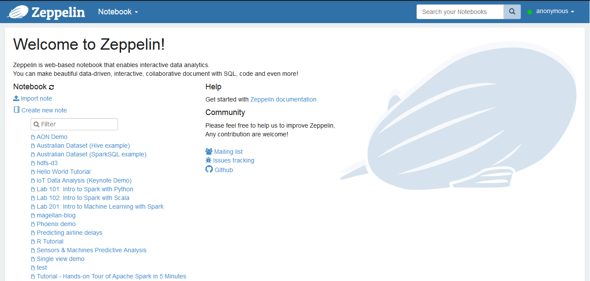
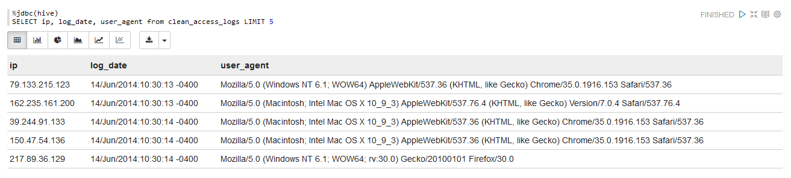

# TD2 - Simulating customer behavior analytics in ecommerce

Log analysis is one of the first use cases enabled by Big Data Processing, from parsing web crawlers logs to analyzing customer behavior on websites by rebuilding their sessions from Apache logs.


In this practice session, we will replicate a (albeit smaller) Big Data pipeline to collect and visualize Apache logs.


!!! warning "Saving some memory using Terminal"
    This tutorial makes heavy use of Hive and Zeppelin to process data. If you are using less than 8 Go of RAM for the virtual machine, try to not use Ambari for this session and only use the terminal to upload and manage data in HDFS. Ambari consumes a lot of memory when acessed so this saves some resources.    

## Objectives

- [ ] Structuring Apache logs with Hive and regex
- [ ] Ingesting Apache logs into HDFS in realtime with Flume
- [ ] Building a data dashboard with Zeppelin

## 1. Structuring Apache logs with Hive and regex

### Upload data to HDFS

Before building the whole pipeline, let's have a look at a sample of Apache logs.

```
164.29.239.18 - - [01/Aug/2014:11:48:59 -0400] "GET /department/apparel/products HTTP/1.1" 200 991 "-" "Mozilla/5.0 (Windows NT 6.3; WOW64) AppleWebKit/537.36 (KHTML, like Gecko) Chrome/35.0.1916.153 Safari/537.36"
```

A sample of Apache logs is available [here](https://github.com/andfanilo/hdp-tutorial/tree/main/data) in the `access.log.2.zip` file. We will upload this data into HDFS, parse it using an external Hive table over it and run some SQL queries.

- Download and unzip the folder, locally or in your virtual machine depending on how you want to upload the data in HDFS.
- Upload the data in HDFS, at the location `/user/root/access`. You should end with `/user/root/access/access.log.2`.

??? tip "Help on terminal"
    ```sh
    [root@sandbox ~]# hdfs dfs -mkdir -p /user/root/access
    [root@sandbox ~]# wget https://github.com/andfanilo/hdp-tutorial/raw/main/data/access.log.2.zip
    --2020-12-05 14:49:52--  https://github.com/andfanilo/hdp-tutorial/raw/main/data/access.log.2.zip
    Resolving github.com... 140.82.121.4
    Connecting to github.com|140.82.121.4|:443... connected.
    HTTP request sent, awaiting response... 302 Found
    Location: https://raw.githubusercontent.com/andfanilo/hdp-tutorial/main/data/access.log.2.zip [following]
    --2020-12-05 14:49:52--  https://raw.githubusercontent.com/andfanilo/hdp-tutorial/main/data/access.log.2.zip
    Resolving raw.githubusercontent.com... 151.101.120.133
    Connecting to raw.githubusercontent.com|151.101.120.133|:443... connected.
    HTTP request sent, awaiting response... 200 OK
    Length: 3224097 (3.1M) [application/zip]
    Saving to: "access.log.2.zip"

    100%[==============================================================================================================================>] 3,224,097   14.4M/s   in 0.2s

    2020-12-05 14:49:53 (14.4 MB/s) - "access.log.2.zip" saved [3224097/3224097]
    [root@sandbox ~]# unzip access.log.2.zip
    Archive:  access.log.2.zip
    inflating: access.log.2
    [root@sandbox ~]# hdfs dfs -copyFromLocal access.log.2 /user/root/access
    ```


- Take a look at the end of the file in HDFS, using the `tail` command in HDFS in the terminal.

??? note "Output"
    ```sh
    [root@sandbox ~]# hdfs dfs -tail access/access.log.2
    6.1; WOW64; rv:30.0) Gecko/20100101 Firefox/30.0"
    64.232.194.248 - - [14/Jun/2014:23:43:32 -0400] "GET /support HTTP/1.1" 200 887 "-" "Mozilla/5.0 (Windows NT 6.1; rv:30.0) Gecko/20100101 Firefox/30.0"
    138.9.185.141 - - [14/Jun/2014:23:43:32 -0400] "GET /department/golf HTTP/1.1" 200 1075 "-" "Mozilla/5.0 (Windows NT 6.3; WOW64) AppleWebKit/537.36 (KHTML, like Gecko) Chrome/35.0.1916.153 Safari/537.36"
    152.208.225.65 - - [14/Jun/2014:23:43:32 -0400] "GET /department/golf HTTP/1.1" 200 1358 "-" "Mozilla/5.0 (Windows NT 6.1) AppleWebKit/537.36 (KHTML, like Gecko) Chrome/35.0.1916.153 Safari/537.36"
    84.246.94.164 - - [14/Jun/2014:23:43:32 -0400] "GET /department/fitness/category/tennis%20&%20racquet HTTP/1.1" 200 907 "-" "Mozilla/5.0 (Windows NT 6.1; WOW64; rv:30.0) Gecko/20100101 Firefox/30.0"
    167.228.157.189 - - [14/Jun/2014:23:43:32 -0400] "GET /department/outdoors HTTP/1.1" 200 2166 "-" "Mozilla/5.0 (Macintosh; Intel Mac OS X 10_9_3) AppleWebKit/537.36 (KHTML, like Gecko) Chrome/35.0.1916.153 Safari/537.36"
    ```

### Build a Hive table over the log file

In the previous tutorial, we created a Hive table over CSV files using the keywords `ROW FORMAT DELIMITED FIELDS TERMINATED BY ','`. The format of the file in HDFS, which Hive will parse on-demand, must be specified at table creation.

Here we will use a `regex` to extract all the information we need from the log files. To enable parsing files in HDFS using regex with Hive, we use a specific SerDe (for serializer/deserializer) `ROW FORMAT SERDE 'org.apache.hadoop.hive.contrib.serde2.RegexSerDe'`. 

This SERDE is not provided by default, we will need to register a `hive-contrib.jar` plugin which contains the class. Otherwise you will get `Caused by: org.apache.hadoop.hive.ql.metadata.HiveException: java.lang.ClassNotFoundException: Class org.apache.hadoop.hive.contrib.serde2.RegexSerDe not found` exceptions.

Let's try this:

- Open a terminal to your Virtual Machine.
- Open a Hive command line: `hive`.
- Add the `hive-contrib.jar` JAR:

```sql
ADD JAR /usr/hdp/current/hive-client/lib/hive-contrib.jar;
```

- Create an external Hive table `intermediate_access_logs` (copy-paste the following command):

```sql
CREATE EXTERNAL TABLE intermediate_access_logs (
    ip STRING,
    log_date STRING,
    method STRING,
    url_site STRING,
    http_version STRING,
    code1 STRING,
    code2 STRING,
    dash STRING,
    user_agent STRING)
ROW FORMAT SERDE 'org.apache.hadoop.hive.contrib.serde2.RegexSerDe'
WITH SERDEPROPERTIES (
    'input.regex' = '([^ ]*) - - \\[([^\\]]*)\\] "([^\ ]*) ([^\ ]*) ([^\ ]*)" (\\d*) (\\d*) "([^"]*)" "([^"]*)"',
    'output.format.string' = "%1$$s %2$$s %3$$s %4$$s %5$$s %6$$s %7$$s %8$$s %9$$s")
LOCATION '/user/root/access';
```

Now whenever you run a SQL query on `intermediate_access_logs`, Hive will run a MapReduce job by first parsing all files in the `/user/root/access` with the provided regex, then run your query. 

??? note "Output"
    ```
    hive> DESCRIBE intermediate_access_logs;
    OK
    ip                      string                  from deserializer
    log_date                string                  from deserializer
    method                  string                  from deserializer
    url_site                string                  from deserializer
    http_version            string                  from deserializer
    code1                   string                  from deserializer
    code2                   string                  from deserializer
    dash                    string                  from deserializer
    user_agent              string                  from deserializer
    Time taken: 0.997 seconds, Fetched: 9 row(s)
    hive> SELECT ip, log_date, user_agent from intermediate_access_logs LIMIT 5;
    OK
    79.133.215.123  14/Jun/2014:10:30:13 -0400      Mozilla/5.0 (Windows NT 6.1; WOW64) AppleWebKit/537.36 (KHTML, like Gecko) Chrome/35.0.1916.153 Safari/537.36
    162.235.161.200 14/Jun/2014:10:30:13 -0400      Mozilla/5.0 (Macintosh; Intel Mac OS X 10_9_3) AppleWebKit/537.76.4 (KHTML, like Gecko) Version/7.0.4 Safari/537.76.4
    39.244.91.133   14/Jun/2014:10:30:14 -0400      Mozilla/5.0 (Macintosh; Intel Mac OS X 10_9_3) AppleWebKit/537.36 (KHTML, like Gecko) Chrome/35.0.1916.153 Safari/537.36
    150.47.54.136   14/Jun/2014:10:30:14 -0400      Mozilla/5.0 (Macintosh; Intel Mac OS X 10_9_3) AppleWebKit/537.36 (KHTML, like Gecko) Chrome/35.0.1916.153 Safari/537.36
    217.89.36.129   14/Jun/2014:10:30:14 -0400      Mozilla/5.0 (Windows NT 6.1; WOW64; rv:30.0) Gecko/20100101 Firefox/30.0
    Time taken: 0.29 seconds, Fetched: 5 row(s)
    hive>
    ```

- Running a query on `intermediate_access_logs` will parse files with regex every time, which is time consuming. Create a new `clean_access_logs` table with the output for `intermediate_access_logs` as content.
    - We also optimize the table storage with the [ORC format](https://orc.apache.org/docs/). Using ORC files improves performance when Hive is reading, writing, and processing data.

```sql
CREATE TABLE clean_access_logs STORED AS ORC AS SELECT * FROM intermediate_access_logs;
```

Also build a smaller table so you can experiment on it before running on the full dataset:

```sql
CREATE TABLE sample_access_logs STORED AS ORC AS SELECT * FROM clean_access_logs LIMIT 1000;
```

You're now free to work on the `clean_access_logs` or `sample_access_logs` tables :smile:

!!! question "SQL questions"
    Choose 1-2 questions to try:

    - Can you count the number of occurences for each IP address ?
    - Display how many times each product has been bought
    - What percentage of IP addresses went to checkout their basket ?
    - If you case the date as a Date you should be able to build a web journey of an IP address on the website. For all IP adresses that went to checkout, compute the number of products each has bought before.

### Zeppelin, the Big Data notebook

Apache Zeppelin is a Web-based notebook for interactive data analytics and collaborative documents. You can plugin multiple interpreters to run different Big Data engine inside, by default Hive JDBC and Spark are already configured to run. 

- Open `http://localhost:9995` for a first peek at Zeppelin.



- Create a new note, write some [Markdown](https://www.markdownguide.org/) in the first cell with `%md` as a first line to choose the Markdown interpreter, and run the cell:


- See what happens when you toggle the `default` view to `simple` and `report`.


- Each cell has its own set of settings too. For example, change the width of the first cell to 6:


- Create a new cell, set the interpreter to `Hive JDBC` with `%jdbc(hive)` and run a SQL query against `clean_access_logs` again.



- Do you see that the `Hive JDBC` cell results have a toolbar for displaying graphs? Play with it a bit then try to replicate the following notebook in `report` view, with a cell for counting the number of occurences for a few ip addresses.


**Recap**

- We loaded raw Apache logs into HDFS
- We parsed them by pointing an Hive Table over the logs with a regex deserializer to parse each line
- We saved Hive tables with the extracted info and optimized with ORC.
- We built a Zeppelin dashboard with some info on the contents of the log.

!!! info "Going back to our objectives"
    - [x] Structuring Apache logs with Hive and regex
    - [ ] Ingesting Apache logs into HDFS in realtime with Flume
    - [ ] Building a data dashboard with Zeppelin

## 2. Generating logs with Python

- Copy gen_logs to VM
- Run Python simulation

## 3. Ingesting data in HDFS with Flume

- Configure Flume
- Output in external Hive table

## 4. Dashboarding with Zeppelin

- TODO

## Conclusion
